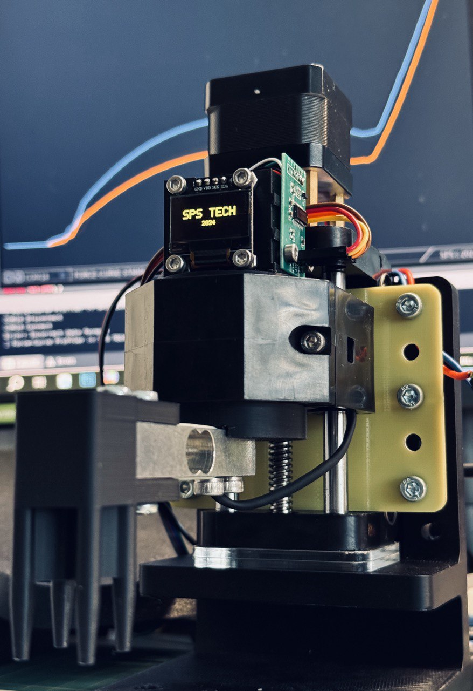
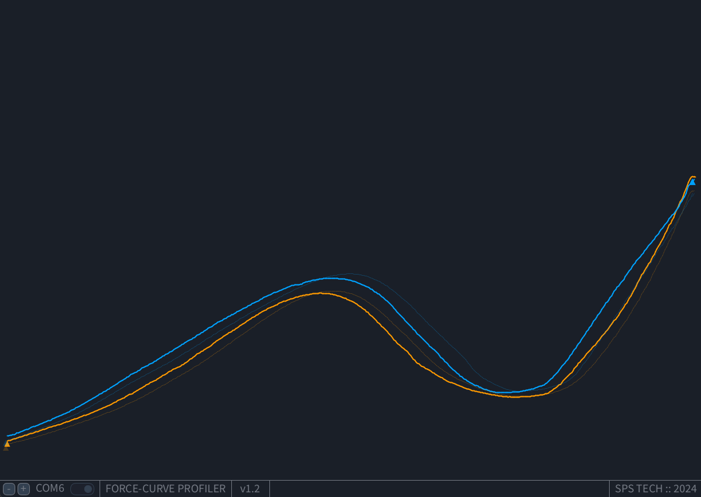

# Force-curve meter for silicone membrane buttons evaluation


Force-curve measurement is a technique used to assess the mechanical properties of materials, such as silicon buttons, by measuring the relationship between applied force and the resulting deformation. For silicon buttons, this method typically involves applying a controlled force to the surface of the button using a probe or actuator and recording the corresponding displacement. The resulting force-displacement curve provides insights into the material's stiffness, elasticity, and mechanical response under load. It helps in determining key parameters like actuation force, tactile feedback, and wear characteristics, which are crucial for quality control and design optimization of silicon buttons used in electronics.



### Features

- Zero Point auto-detect
- CSV file auto-save `(/data/scans/)`
- Last scan shadow reference on the screen `(/data/ref_scan.csv)`
- Generated scans can be easily opened in different viewers `(note the \t separator)`
- Two types of probes `(see. /3d_models/)`

### Hardware

-   Stepper motor
-   16x micro steps stepper motor driver
-   Weight sensor 1kG
-   HX711 a precision 24-bit analog-to-digital converter (ADC) designed for weigh scales.
-   OLED SSD1306 based display 128x64
-   Arduino Nano
-   Limit switch (for home parking)
-   Button (for user interactions)

```
Board                Component           Pin on Component
---------------      ------------------  ----------------
   5V                VCC (All modules)   VCC / +5V
   GND               GND (All modules)   GND
   A4 (SDA)          OLED SDA            SDA
   A5 (SCL)          OLED SCL            SCL
   D3                HX711 DOUT          DOUT
   D4                HX711 SCK           SCK
   D8                Stepper DIR         DIR
   D9                Stepper STEP        STEP
   D10               Stepper SLEEP       SLEEP
   A0                Home contact        → one side to A0, other side to GND
   A1                Control Button      → one side to A1, other side to GND
   D13 (LED_BUILTIN) Status LED          LED (built‑in)
```

### Required Libraries
- **Arduino** (built-in)
- **Wire** (built-in)
- **BasicStepperDriver** by simplelabs (install via Library Manager or https://github.com/simplelabs/BasicStepperDriver)
- **HX71*1** by bogde (install via Library Manager or https://github.com/bogde/HX711)
- **GyverOLED** by GYVER (install via Library Manager or https://github.com/GyverLibs/GyverOLED)

### Scan example

